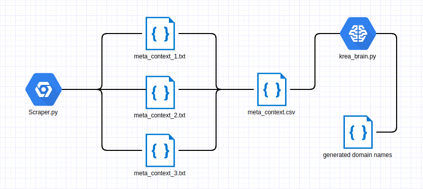

# NameKrea An AI That Generates Domain Names

Namekrea is an deep learning model which is able to
create domain names on a given context. It uses GPT-2 model from OpenAI and the gpt-simple package. You can check out the working project
under namekrea.com

## Introduction

I had a goal in my mind to create an AI service which is helpful to people and yet could turn into a small business.
After fiddling around with GPT-2, I have realised it has an immense creative potential that could prove useful in
creative text generation. Therefore I created NameKrea.com which is an AI that generates domain names. Domain name generator business
is online since long time, but it hasn't seen this amount of good content.

After scraping around 100.000 websites from the Majestic Millions top 1 Million Domain list, I have fine-tuned 355M parameter model.
Results are weirdly accurate and also creative at the same time. Have a look at the results:

<table>
  <tr>
    <th>Meta Text</th>
    <th>Domain Name</th>
  </tr>
  <tr>
    <td>'The fastest, easiest way to create your own chess set! Includes instructions, guidebook, pieces, board, pieces for home and classroom use.'</td>
    <td>chessytee.com</td>
  </tr>
  <tr>
    <td>'The nonprofit that builds homes for people with special needs in Minneapolis Minnesota.'</td>
    <td>firstpointhomes.org</td>
  </tr>
  <tr>
    <td>'A Complete Guide to the Fun and Useful Magic of the Roller Coaster Industry'</td>
    <td>coastercity.net</td>
  </tr>
  <tr>
    <td>'Official Dolor-6 Online Store. Buy Dolor-6 Stereo, Home Theater, and Microphones. New Releases and Special Offers from the Dolor-6 Manufacturer'</td>
    <td>dolor-6.com</td>
  </tr>
</table>

GPT-2 is already trained language model which is capable of creating text with a near human quality. It's able to understand
the context of a given prefix to generate text. When fine tuned based on the domain names and their meta context,
it was able to understand the relation between domain name and the content of the website.

## Step 1: Scraping Domain Names and Meta Context
GPT-2 needs lots of data to be trained properly. Quality of the data that we will use for fine tuning will have a direct effect on the model quality
therefore we need to make sure the data we are scraping from the websites are as clean as possible.
I have implemented several logic into the scraper.py script for reducing the amount of non-English content.
There are still lot of room for improvement.

## Step 2: Fine Tuning GPT-2 With Domain Names and Meta Context
When scraping is done, we need to feed the scraped data into **model_trainer.py** to fine tune and train
the GPT-2. When you run the script it will first download the already trained 355M model and then it will start training
If you don't have a GPU, it might take painfully long. On my research computer with 2x1070Ti's needed around 30 minutes to fully train.

## Step3: Generate Domain Names with Namekrea!
When training is done you will have your working model under the models directory. Use the model under this directory to run **text_generator.py**
script and see the deep learning magic with your own eyes :)
General architecture of the project looks like the following:

Detailed article about this project and how-to can be found under this medium publication: https://towardsdatascience.com/how-i-fine-tuned-gpt-2-to-generate-creative-domain-names-a56d59d55aca

Project is already online, if you want to test it you can [generate AI Domain Names through this link.](https://namekrea.com)

